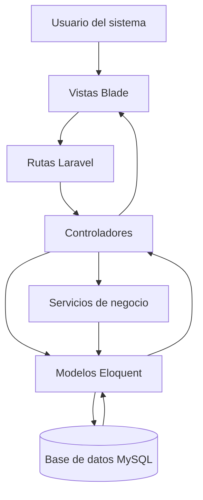
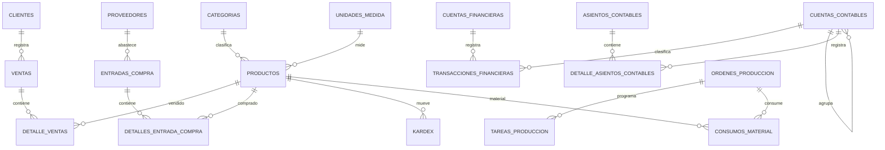
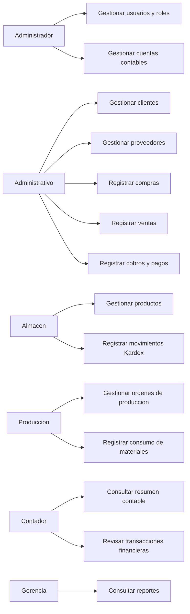
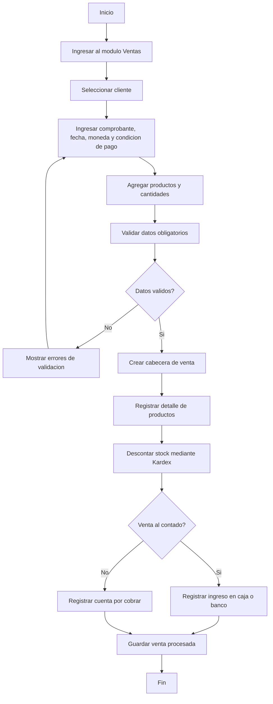
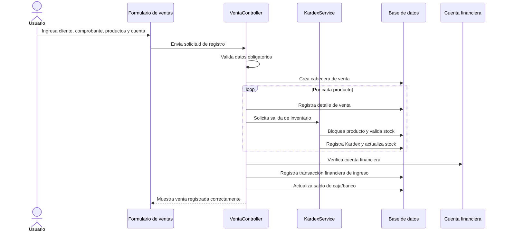

# PRODUCTO ACREDITABLE DEL CURSO

## "ANALISIS, MODELAMIENTO Y DESARROLLO DE UN SISTEMA DE INFORMACION CONTABLE PARA UNA EMPRESA PERUANA"

**INFORME 02: DISEÑAR E IMPLEMENTAR PARCIALMENTE EL PROTOTIPO FUNCIONAL DEL SISTEMA DE INFORMACION CONTABLE**

**Proyecto:** Sistema de Informacion Contable y Administrativo PISFIL SIG v1.0  
**Empresa:** Estructuras Metalicas PISFIL EMSAC  
**Integrantes:** Cesar Augusto Pisfil Cachay, Piero Alessandro Alva Muro y Jairo Alexis Muro Montenegro  
**Periodo:** 2026-I

---

### *I. AVANCE DEL SISTEMA DESARROLLADO*

#### 1.1 Descripcion del proyecto

El presente proyecto corresponde al desarrollo de un Sistema de Informacion Contable y Administrativo para la empresa **Estructuras Metalicas PISFIL EMSAC**, identificada con RUC N.º 20608324641, ubicada en la ciudad de Chiclayo y dedicada a la fabricacion, transformacion y comercializacion de estructuras metalicas y materiales vinculados al sector metalmecanico y obras civiles. La empresa trabaja principalmente bajo un modelo de produccion por pedido o *Make-to-Order*, en el cual los procesos de abastecimiento, produccion, venta y cobranza se activan segun los requerimientos especificos de cada cliente.

El problema identificado en la empresa es la existencia de registros manuales y datos dispersos entre las areas de compras, almacen, produccion, ventas, caja y contabilidad. Esta situacion dificulta conocer el stock real de materiales, calcular costos por proyecto, controlar pagos y cobros, y consolidar informacion financiera oportuna para la toma de decisiones.

El objetivo general del sistema es **integrar y automatizar los procesos operativos y contables de PISFIL EMSAC mediante una aplicacion web modular**, permitiendo registrar compras, ventas, movimientos de inventario, operaciones de caja y bancos, ordenes de produccion y cuentas contables basadas en el Plan Contable General Empresarial (PCGE).

El alcance de esta segunda entrega comprende el diseño de la base de datos, la implementacion parcial del prototipo funcional y la integracion inicial de los modulos principales: autenticacion, dashboard, clientes, proveedores, productos, compras, inventario, ventas, caja y bancos, contabilidad, reportes, usuarios, roles y produccion.

#### 1.2 Estado actual del proyecto

Desde la entrega del Informe 01 se avanzo desde el analisis y modelamiento preliminar hacia la construccion del prototipo funcional. Las actividades desarrolladas se concentraron en la configuracion del proyecto Laravel, la definicion de la estructura relacional de datos y la implementacion de formularios funcionales para los procesos centrales de la empresa.

Los principales componentes implementados son:

| Componente | Estado | Descripcion del avance |
| :--- | :--- | :--- |
| Configuracion del proyecto Laravel | Finalizado | Se configuro la aplicacion web, rutas, controladores, modelos, vistas Blade, dependencias de Composer, NPM y Vite. |
| Autenticacion de usuarios | Finalizado | Se implemento inicio y cierre de sesion con validacion de correo y contraseña. |
| Gestion de usuarios y roles | En proceso | Se implementaron usuarios, roles y permisos mediante tablas `users`, `roles`, `permisos` y `rol_permiso`. |
| Gestion de clientes | Finalizado | Permite registrar, actualizar y listar clientes, validando documento unico y correo valido. |
| Gestion de proveedores | Finalizado | Permite administrar proveedores, RUC, datos de contacto, condicion de pago y estado. |
| Gestion de productos | Finalizado | Permite registrar productos con categoria, unidad de medida, precio, stock minimo y stock actual. |
| Compras | En proceso | Permite registrar entradas de compra, agregar detalles, cambiar estados y procesar recepcion hacia Kardex. |
| Inventario y Kardex | En proceso | Se implemento dashboard de inventario, movimientos Kardex, stock bajo, reporte de stock y movimientos manuales. |
| Ventas | En proceso | Permite registrar ventas al contado o credito, agregar productos, descontar inventario y registrar cobros. |
| Caja y bancos | En proceso | Permite registrar cuentas financieras, ingresos, egresos y transferencias entre cuentas de la misma moneda. |
| Contabilidad y PCGE | En proceso avanzado | Se implemento el catalogo de cuentas contables, la generacion automatica de asientos y la consulta de Libro Diario. |
| Produccion | En proceso | Se implementaron ordenes de produccion, tareas, avances y consumos de materiales. |
| Reportes gerenciales | Parcial | Se cuenta con dashboard de reportes como base para consolidar indicadores. |

El porcentaje aproximado de avance del proyecto es de **78 %**, considerando que la estructura de datos, los modulos principales y la generacion inicial de asientos contables ya se encuentran implementados. Aun falta fortalecer reportes finales, Libro Mayor, Balance de Comprobacion, exportaciones, pruebas integrales ampliadas y documentacion de usuario.

#### 1.3 Tecnologias utilizadas

| Herramienta | Descripcion |
| :--- | :--- |
| Visual Studio Code | Entorno de desarrollo utilizado para programar y organizar el proyecto. |
| PHP 8.3+ | Lenguaje principal utilizado en el backend. |
| Laravel 13 | Framework utilizado para construir la aplicacion web bajo el patron MVC. |
| Laravel Sanctum | Soporte para autenticacion y proteccion de rutas. |
| MySQL | Sistema gestor de base de datos relacional. |
| Blade | Motor de plantillas utilizado para las vistas del sistema. |
| Vite | Herramienta para compilar y servir recursos frontend. |
| Tailwind CSS | Framework CSS utilizado para el diseño de interfaces. |
| Composer | Gestor de dependencias PHP. |
| NPM | Gestor de dependencias JavaScript. |
| Git | Control de versiones del proyecto. |
| MySQL Workbench / Draw.io | Herramientas propuestas para el diseño y representacion de la base de datos. |
| Bizagi Modeler | Herramienta empleada para el modelamiento de procesos BPMN. |

#### 1.4 Cronograma actualizado

| Actividad | Estado | Observacion |
| :--- | :--- | :--- |
| Analisis y diagnostico empresarial | Finalizado | Desarrollado en el Informe 01. |
| Definicion de requerimientos funcionales y no funcionales | Finalizado | Requerimientos alineados a compras, ventas, inventario, caja y contabilidad. |
| Diseño de arquitectura MVC | Finalizado | Aplicacion web basada en Laravel. |
| Diseño de base de datos | Finalizado | Migraciones creadas para los modulos principales. |
| Implementacion de autenticacion | Finalizado | Login y logout operativos. |
| Clientes y proveedores | Finalizado | CRUD funcional con validaciones. |
| Productos e inventario | En proceso | Registro de productos, Kardex y stock bajo implementados parcialmente. |
| Compras | En proceso | Registro de cabecera, detalle, estado de compra, pagos y actualizacion de Kardex. |
| Ventas | En proceso | Registro de ventas, detalles, cobros y salida de inventario. |
| Caja y bancos | En proceso | Cuentas, ingresos, egresos y transferencias implementadas. |
| Contabilidad y PCGE | En proceso avanzado | Catalogo PCGE, resumen mensual, asientos automaticos y Libro Diario implementados. |
| Produccion | En proceso | Ordenes, tareas y consumos de materiales en desarrollo. |
| Reportes finales | En proceso | Se implemento Libro Diario; faltan Libro Mayor, Balance de Comprobacion y exportaciones. |
| Pruebas integrales | En proceso | Se ejecutaron pruebas base; faltan pruebas completas de procesos encadenados. |
| Manual de usuario | Pendiente | Programado para la entrega final. |

#### 1.5 Evidencias del avance

Las siguientes capturas deben incorporarse desde la version actual del prototipo:

| Evidencia | Descripcion | Estado |
| :--- | :--- | :--- |
| Captura 1: Login | Pantalla de inicio de sesion. | Pendiente de insertar imagen. |
| Captura 2: Dashboard | Vista principal posterior al inicio de sesion. | Pendiente de insertar imagen. |
| Captura 3: Productos | Listado y mantenimiento de productos. | Pendiente de insertar imagen. |
| Captura 4: Inventario | Dashboard de inventario y movimientos Kardex. | Pendiente de insertar imagen. |
| Captura 5: Compras | Registro de entradas de compra y detalle. | Pendiente de insertar imagen. |
| Captura 6: Ventas | Registro de venta al contado o credito. | Pendiente de insertar imagen. |
| Captura 7: Caja y bancos | Movimientos financieros y saldos de cuentas. | Pendiente de insertar imagen. |
| Captura 8: Plan de cuentas | Catalogo PCGE implementado en el sistema. | Pendiente de insertar imagen. |
| Captura 9: Libro Diario | Asientos contables generados por compras, ventas, cobros, pagos y tesoreria. | Pendiente de insertar imagen. |

---

### *II. DISEÑO DE LA SOLUCION*

#### 2.1 Arquitectura del Software

El sistema desarrollado es una **aplicacion web local** construida con Laravel, orientada a centralizar los procesos administrativos, operativos y contables de PISFIL EMSAC. La arquitectura empleada corresponde al patron **Modelo-Vista-Controlador (MVC)**, propio del framework Laravel.

La solucion se organiza en las siguientes capas:

| Capa | Componentes del proyecto | Funcion |
| :--- | :--- | :--- |
| Presentacion | Vistas Blade en `resources/views` | Muestra formularios, listados, dashboards y mensajes de validacion al usuario. |
| Controlador | Controladores en `app/Http/Controllers` | Recibe solicitudes, valida datos, aplica reglas de negocio y coordina la respuesta. |
| Modelo | Modelos Eloquent en `app/Models` | Representa las entidades principales y sus relaciones con la base de datos. |
| Servicio | `KardexService` y `AsientoContableService` | Centraliza la logica de movimientos de inventario, promedio ponderado, actualizacion de stock y generacion de asientos contables. |
| Datos | Migraciones y base de datos MySQL | Almacena usuarios, clientes, proveedores, productos, compras, ventas, Kardex, caja, bancos, cuentas contables y asientos contables. |

Diagrama de arquitectura:



#### 2.2 Diseño de la Base de Datos

La base de datos se diseño de forma relacional, separando las entidades maestras, documentos transaccionales y registros de control. Las tablas principales son:

| Tabla | Funcion | Llave primaria | Relaciones principales |
| :--- | :--- | :--- | :--- |
| `users` | Almacena usuarios del sistema. | `id` | Pertenece a `roles`; registra compras, ventas, Kardex y transacciones. |
| `roles` | Define perfiles de usuario. | `id` | Se relaciona con `users` y `permisos`. |
| `permisos` | Define permisos del sistema. | `id` | Relacion muchos a muchos con `roles` mediante `rol_permiso`. |
| `clientes` | Registra clientes de la empresa. | `id` | Se relaciona con `ventas`. |
| `proveedores` | Registra proveedores. | `id` | Se relaciona con `entradas_compra`. |
| `categorias` | Clasifica productos. | `id` | Se relaciona con `productos`. |
| `unidades_medida` | Define unidades de medida. | `id` | Se relaciona con `productos` y consumos de material. |
| `productos` | Registra materiales, insumos o productos. | `id` | Pertenece a categoria y unidad; se relaciona con Kardex, ventas, compras y consumos. |
| `entradas_compra` | Cabecera de documentos de compra. | `id` | Pertenece a proveedor y usuario; tiene detalles. |
| `detalles_entrada_compra` | Detalle de productos comprados. | `id` | Pertenece a compra y producto. |
| `kardex` | Registra entradas, salidas, ajustes y devoluciones de inventario. | `id` | Pertenece a producto y usuario. |
| `ventas` | Cabecera de ventas. | `id` | Pertenece a cliente, cuenta financiera y usuario. |
| `detalle_ventas` | Detalle de productos vendidos. | `id` | Pertenece a venta y producto. |
| `cuentas_financieras` | Registra caja y bancos. | `id` | Se relaciona con transacciones financieras y ventas. |
| `transacciones_financieras` | Registra ingresos, egresos y transferencias. | `id` | Pertenece a cuenta financiera, usuario y cuenta contable. |
| `cuentas_contables` | Catalogo PCGE. | `id` | Relacion jerarquica consigo misma mediante `padre_id`. |
| `asientos_contables` | Cabecera de los asientos contables generados por el sistema. | `id` | Se relaciona con usuario y con sus detalles. |
| `detalle_asientos_contables` | Detalle del Debe y Haber de cada asiento. | `id` | Pertenece a asiento contable y cuenta contable. |
| `ordenes_produccion` | Registra trabajos o proyectos de produccion. | `id` | Se relaciona con tareas y consumos de material. |
| `tareas_produccion` | Controla actividades por orden. | `id` | Pertenece a orden, proceso y usuario responsable. |
| `consumos_material` | Registra materiales usados en produccion. | `id` | Pertenece a orden, producto y unidad de medida. |

#### 2.3 Modelo Entidad-Relacion

El modelo entidad-relacion integra los procesos de compras, ventas, inventario, produccion, caja/bancos y contabilidad en una sola base de datos. Las relaciones principales son:

- Un cliente puede tener muchas ventas.
- Una venta puede contener muchos productos mediante `detalle_ventas`.
- Un proveedor puede tener muchas entradas de compra.
- Una entrada de compra puede contener muchos productos mediante `detalles_entrada_compra`.
- Un producto puede registrar muchos movimientos Kardex.
- Una cuenta financiera puede registrar muchas transacciones financieras.
- Una transaccion financiera puede asociarse a una cuenta contable del PCGE.
- Una cuenta contable puede tener subcuentas mediante una relacion jerarquica.
- Un asiento contable puede tener varios detalles en el Debe y Haber.
- Cada detalle de asiento se asocia a una cuenta del PCGE.
- Una orden de produccion puede tener tareas y consumos de materiales.

Diagrama entidad-relacion resumido:



#### 2.4 Diccionario de Datos

A continuacion se presenta un diccionario de datos resumido de las tablas mas relevantes:

**Tabla: `clientes`**

| Campo | Tipo | Longitud | Descripcion |
| :--- | :--- | :--- | :--- |
| `id` | bigint | - | Identificador unico del cliente. |
| `nombre` | varchar | 255 | Nombre o razon social. |
| `documento_identidad` | varchar | 20 | DNI o RUC del cliente, unico. |
| `direccion` | varchar | 255 | Direccion del cliente. |
| `telefono` | varchar | 20 | Telefono de contacto. |
| `email` | varchar | 100 | Correo electronico. |
| `estado` | boolean | - | Indica si el cliente esta activo. |

**Tabla: `productos`**

| Campo | Tipo | Longitud | Descripcion |
| :--- | :--- | :--- | :--- |
| `id` | bigint | - | Identificador del producto. |
| `codigo` | varchar | 50 | Codigo interno unico. |
| `nombre` | varchar | 150 | Nombre del producto o material. |
| `categoria_id` | bigint | - | Categoria asociada. |
| `unidad_medida_id` | bigint | - | Unidad de medida asociada. |
| `precio_unitario` | decimal | 12,2 | Costo o precio unitario actual. |
| `stock_minimo` | integer | - | Cantidad minima permitida. |
| `stock_actual` | integer | - | Stock disponible. |
| `estado` | varchar | 20 | Estado del producto. |

**Tabla: `entradas_compra`**

| Campo | Tipo | Longitud | Descripcion |
| :--- | :--- | :--- | :--- |
| `id` | bigint | - | Identificador de la compra. |
| `numero_documento` | varchar | 50 | Numero de factura, boleta u orden, unico. |
| `proveedor_id` | bigint | - | Proveedor asociado. |
| `fecha_emision` | datetime | - | Fecha del documento. |
| `fecha_recepcion` | datetime | - | Fecha en que se recepciono la compra. |
| `estado` | varchar | 30 | Pendiente, recibida, validada o rechazada. |
| `usuario_id` | bigint | - | Usuario que registra la compra. |

**Tabla: `ventas`**

| Campo | Tipo | Longitud | Descripcion |
| :--- | :--- | :--- | :--- |
| `id` | bigint | - | Identificador de la venta. |
| `cliente_id` | bigint | - | Cliente asociado. |
| `tipo_comprobante` | varchar | 20 | Factura, boleta o ticket. |
| `serie_comprobante` | varchar | 10 | Serie del comprobante. |
| `numero_comprobante` | varchar | 20 | Numero del comprobante. |
| `fecha_venta` | date | - | Fecha de venta. |
| `moneda` | varchar | 10 | PEN o USD. |
| `total` | decimal | 12,2 | Total de la venta. |
| `estado` | enum | - | Borrador, pagada o anulada. |
| `condicion_pago` | varchar | - | Contado o credito. |
| `estado_pago` | varchar | - | Pendiente, parcial o pagado. |

**Tabla: `kardex`**

| Campo | Tipo | Longitud | Descripcion |
| :--- | :--- | :--- | :--- |
| `id` | bigint | - | Identificador del movimiento. |
| `producto_id` | bigint | - | Producto afectado. |
| `tipo_movimiento` | varchar | 20 | Entrada, salida, ajuste o devolucion. |
| `cantidad` | decimal | 12,2 | Cantidad movida. |
| `precio_unitario` | decimal | 12,2 | Costo aplicado al movimiento. |
| `saldo_anterior` | decimal | 15,2 | Stock antes del movimiento. |
| `saldo_actual` | decimal | 15,2 | Stock posterior al movimiento. |
| `referencia_tipo` | varchar | 50 | Origen del movimiento. |
| `usuario_id` | bigint | - | Usuario que registra. |
| `fecha_movimiento` | datetime | - | Fecha del movimiento. |

**Tabla: `cuentas_contables`**

| Campo | Tipo | Longitud | Descripcion |
| :--- | :--- | :--- | :--- |
| `id` | bigint | - | Identificador de la cuenta. |
| `codigo` | varchar | 20 | Codigo PCGE. |
| `descripcion` | varchar | 255 | Nombre de la cuenta contable. |
| `elemento` | varchar | 5 | Elemento contable. |
| `nivel` | integer | - | Nivel jerarquico de la cuenta. |
| `tipo` | varchar | 50 | Activo, Pasivo, Patrimonio, Gasto o Ingreso. |
| `padre_id` | bigint | - | Cuenta padre, si corresponde. |
| `estado` | boolean | - | Indica si la cuenta esta activa. |

**Tabla: `asientos_contables`**

| Campo | Tipo | Longitud | Descripcion |
| :--- | :--- | :--- | :--- |
| `id` | bigint | - | Identificador del asiento contable. |
| `numero` | varchar | 40 | Codigo unico del asiento. |
| `fecha` | date | - | Fecha contable del registro. |
| `descripcion` | varchar | 255 | Glosa general del asiento. |
| `origen_tipo` | varchar | 80 | Modulo que genero el asiento. |
| `origen_id` | bigint | - | Identificador del registro de origen. |
| `moneda` | varchar | 10 | Moneda del asiento. |
| `total_debe` | decimal | 15,2 | Suma de importes registrados al Debe. |
| `total_haber` | decimal | 15,2 | Suma de importes registrados al Haber. |
| `estado` | enum | - | Borrador, confirmado o anulado. |
| `usuario_id` | bigint | - | Usuario que genero el asiento. |

**Tabla: `detalle_asientos_contables`**

| Campo | Tipo | Longitud | Descripcion |
| :--- | :--- | :--- | :--- |
| `id` | bigint | - | Identificador del detalle. |
| `asiento_contable_id` | bigint | - | Asiento contable asociado. |
| `cuenta_contable_id` | bigint | - | Cuenta PCGE utilizada. |
| `tipo_movimiento` | enum | - | Debe o Haber. |
| `monto` | decimal | 15,2 | Importe del detalle. |
| `glosa` | varchar | 255 | Descripcion especifica de la linea contable. |

---

### *III. DESARROLLO FUNCIONAL*

#### 3.1 Modulo de autenticacion

**Objetivo del modulo:** controlar el acceso al sistema mediante credenciales validas.

**Funciones implementadas:** mostrar formulario de login, validar correo y contraseña, iniciar sesion, regenerar sesion y cerrar sesion.

**Validaciones implementadas:** correo obligatorio con formato valido, contraseña obligatoria y control de credenciales incorrectas.

**Captura del formulario:** pendiente de insertar.

**Descripcion del funcionamiento:** el usuario ingresa su correo y contraseña. Si las credenciales coinciden con la base de datos, el sistema redirige al dashboard; de lo contrario, muestra un mensaje de error.

#### 3.2 Modulo de clientes

**Objetivo del modulo:** administrar los clientes asociados a ventas y cuentas por cobrar.

**Funciones implementadas:** listar clientes, registrar nuevos clientes y actualizar informacion existente.

**Validaciones implementadas:** nombre obligatorio, documento de identidad obligatorio y unico, correo con formato valido, longitud maxima para telefono y direccion.

**Captura del formulario:** pendiente de insertar.

**Descripcion del funcionamiento:** el usuario registra los datos del cliente. El sistema verifica que el documento no este duplicado y almacena la informacion para ser utilizada en el modulo de ventas.

#### 3.3 Modulo de proveedores

**Objetivo del modulo:** controlar la informacion de proveedores que abastecen materiales e insumos.

**Funciones implementadas:** registrar, editar, listar y consultar proveedores activos.

**Validaciones implementadas:** codigo unico, nombre de empresa obligatorio, RUC unico, correo valido y plazo de entrega numerico.

**Captura del formulario:** pendiente de insertar.

**Descripcion del funcionamiento:** el usuario registra los datos comerciales del proveedor, incluyendo contacto, RUC, condicion de pago y estado. Esta informacion se utiliza al registrar entradas de compra.

#### 3.4 Modulo de productos e inventario

**Objetivo del modulo:** administrar los materiales, insumos y productos de la empresa, controlando existencias y valorizacion.

**Funciones implementadas:** registro de productos, edicion, listado, consulta de productos activos, dashboard de inventario, reporte de stock, stock bajo y movimientos Kardex.

**Validaciones implementadas:** codigo unico, categoria obligatoria, unidad de medida obligatoria, precio no negativo, stock minimo no negativo y stock actual no negativo. Cuando un producto ya tiene movimientos Kardex, el sistema evita modificar directamente el stock actual desde el mantenimiento del producto.

**Captura del formulario:** pendiente de insertar.

**Descripcion del funcionamiento:** el usuario registra un producto con su unidad, categoria, precio y stock. Luego los movimientos de compra, venta o ajuste actualizan el Kardex y el stock disponible.

#### 3.5 Modulo de compras

**Objetivo del modulo:** registrar compras de materiales o insumos y actualizar el inventario cuando la compra es validada.

**Funciones implementadas:** registro de entrada de compra, seleccion de proveedor, fecha de emision, detalle de productos comprados, cambio de estado, recepcion, validacion y registro de pagos.

**Validaciones implementadas:** numero de documento unico, proveedor obligatorio, fecha obligatoria, productos existentes, cantidades mayores a cero, precio unitario no negativo, validacion de compra sin detalles y control de pago que no exceda el total de la factura.

**Captura del formulario:** pendiente de insertar.

**Descripcion del funcionamiento:** el usuario registra la cabecera de la compra y agrega los productos. Cuando la compra pasa a estado validada, el sistema registra automaticamente una entrada en Kardex por cada detalle y actualiza el stock de los productos.

#### 3.6 Modulo de ventas

**Objetivo del modulo:** registrar ventas al contado o credito, controlar cuentas por cobrar y actualizar inventario.

**Funciones implementadas:** listado de ventas, registro de venta, seleccion de cliente, comprobante, moneda, condicion de pago, detalle de productos, registro de cobros y visualizacion de la venta.

**Validaciones implementadas:** cliente obligatorio, comprobante valido, fecha obligatoria, moneda PEN o USD, condicion de pago contado o credito, cuenta financiera obligatoria para ventas al contado, productos requeridos, cantidades positivas, total mayor a cero y control de cobros que no excedan el total de la venta.

**Captura del formulario:** pendiente de insertar.

**Descripcion del funcionamiento:** el usuario registra una venta y agrega productos. El sistema calcula subtotales, descuenta inventario mediante Kardex y, si la venta es al contado, registra automaticamente el ingreso en caja o banco.

#### 3.7 Modulo de caja y bancos

**Objetivo del modulo:** controlar ingresos, egresos, saldos y transferencias entre cuentas financieras.

**Funciones implementadas:** dashboard de caja y bancos, registro de cuentas, movimientos de ingreso y egreso, transferencias entre cuentas y consulta de transacciones.

**Validaciones implementadas:** tipo de cuenta valido, moneda PEN o USD, monto mayor a cero, saldo suficiente para egresos, transferencia hacia cuenta distinta y restriccion de transferencias entre cuentas de distinta moneda.

**Captura del formulario:** pendiente de insertar.

**Descripcion del funcionamiento:** el usuario registra cuentas de caja o banco. Luego puede registrar movimientos financieros o transferencias, actualizando saldos de manera automatica y dejando trazabilidad por usuario.

#### 3.8 Modulo de contabilidad y plan de cuentas

**Objetivo del modulo:** organizar las operaciones economicas mediante cuentas contables basadas en el PCGE.

**Funciones implementadas:** listado del plan de cuentas, creacion y edicion de cuentas, jerarquia por cuenta padre, clasificacion por elemento, tipo y nivel, resumen mensual de ventas, compras, IGV, movimientos de tesoreria, generacion automatica de asientos y consulta de Libro Diario.

**Validaciones implementadas:** codigo contable unico, descripcion obligatoria, elemento obligatorio, nivel entre 2 y 6, cuenta padre existente y bloqueo de eliminacion cuando una cuenta tiene subcuentas.

**Captura del formulario:** pendiente de insertar.

**Descripcion del funcionamiento:** el usuario consulta o registra cuentas contables. Las operaciones de ventas, compras, cobros, pagos y movimientos financieros generan asientos contables balanceados, asociando cada linea del Debe y Haber a cuentas del PCGE. Posteriormente, el usuario puede consultar estos registros desde el Libro Diario.

#### 3.9 Modulo de produccion

**Objetivo del modulo:** controlar trabajos de fabricacion metalmecanica, tareas asignadas y materiales consumidos por orden.

**Funciones implementadas:** registro de ordenes de produccion, actualizacion de estado, registro de tareas, avance de tareas y consumo de materiales.

**Validaciones implementadas:** numero de orden unico, fechas de planificacion, usuario creador, usuario asignado, responsable de tarea, producto existente y cantidad de material planificada.

**Captura del formulario:** pendiente de insertar.

**Descripcion del funcionamiento:** el usuario registra una orden de produccion asociada a un trabajo especifico. Luego se agregan tareas y consumos de material, permitiendo mayor trazabilidad de costos por proyecto.

---

### *IV. INTEGRACION CONTABLE*

#### 4.1 Aplicacion del Plan Contable General Empresarial (PCGE)

El Plan Contable General Empresarial (PCGE) es la estructura oficial utilizada en el Peru para clasificar las operaciones economicas de las empresas. En el sistema PISFIL SIG v1.0 se ha implementado una tabla de cuentas contables que permite registrar codigo, descripcion, elemento, nivel, tipo de cuenta y relacion jerarquica con una cuenta padre.

Las cuentas implementadas en esta etapa corresponden principalmente a los elementos vinculados con los procesos desarrollados:

| Cuenta | Descripcion | Uso en el sistema |
| :--- | :--- | :--- |
| 10 | Efectivo y equivalentes de efectivo | Caja, bancos, cobros y pagos. |
| 101 | Caja | Registro de efectivo. |
| 104 | Cuentas corrientes en instituciones financieras | Movimientos bancarios. |
| 12 | Cuentas por cobrar comerciales - Terceros | Ventas al credito. |
| 121 | Facturas, boletas y otros comprobantes por cobrar | Cobros pendientes de clientes. |
| 20 | Mercaderias | Control de inventario comercial. |
| 24 | Materias primas | Materiales usados en produccion. |
| 40 | Tributos por pagar | IGV calculado en compras y ventas. |
| 42 | Cuentas por pagar comerciales - Terceros | Compras al credito o deudas con proveedores. |
| 421 | Facturas, boletas y otros comprobantes por pagar | Pagos pendientes a proveedores. |
| 60 | Compras | Registro de compras de bienes o materiales. |
| 69 | Costo de ventas | Salidas valorizadas de inventario. |
| 70 | Ventas | Ingresos por ventas. |
| 701 | Mercaderias | Venta de productos o materiales. |
| 702 | Productos terminados | Venta de productos fabricados. |

#### 4.2 Automatizacion de asientos contables

En esta etapa, la automatizacion contable ya cuenta con una implementacion funcional inicial. El sistema registra asientos contables en las tablas `asientos_contables` y `detalle_asientos_contables`, utilizando el servicio `AsientoContableService` para validar que el total del Debe sea igual al total del Haber antes de guardar cada asiento.

Los asientos se generan automaticamente desde los siguientes procesos:

- Registro de ventas al contado y al credito.
- Cobro de ventas al credito.
- Validacion de compras.
- Pago de compras a proveedores.
- Movimientos manuales de caja y bancos con cuenta contable asociada.
- Transferencias entre cuentas financieras.

Flujo actual de automatizacion:

```text
Usuario registra una operacion
         |
         v
El sistema valida datos obligatorios
         |
         v
Identifica el tipo de operacion: compra, venta, cobro, pago o transferencia
         |
         v
Actualiza inventario, caja/bancos o cuentas por cobrar/pagar
         |
         v
Asocia la operacion a una cuenta contable cuando corresponde
         |
         v
Genera el asiento contable
         |
         v
Valida Debe = Haber
         |
         v
Guarda el asiento para consulta en Libro Diario
```

**Ejemplo 1: compra validada**

Cuando el usuario valida una compra, el sistema registra la entrada de materiales en Kardex y actualiza el stock. Contablemente, la operacion puede representarse asi:

| Cuenta | Debe | Haber |
| :--- | ---: | ---: |
| 60 Compras | Importe base | |
| 401 IGV | IGV | |
| 421 Facturas por pagar | | Total |

**Ejemplo 2: venta al contado**

Cuando el usuario registra una venta al contado, el sistema descuenta inventario y registra un ingreso financiero:

| Cuenta | Debe | Haber |
| :--- | ---: | ---: |
| 101 Caja / 104 Banco | Total | |
| 701 Ventas | | Base imponible |
| 401 IGV | | IGV |

**Ejemplo 3: cobro de venta al credito**

Cuando el cliente paga una venta pendiente, el sistema registra el cobro en una cuenta financiera:

| Cuenta | Debe | Haber |
| :--- | ---: | ---: |
| 101 Caja / 104 Banco | Monto cobrado | |
| 121 Facturas por cobrar | | Monto cobrado |

**Ejemplo 4: pago de compra**

Cuando se paga una factura de proveedor, el sistema valida saldo disponible y registra el egreso:

| Cuenta | Debe | Haber |
| :--- | ---: | ---: |
| 421 Facturas por pagar | Monto pagado | |
| 101 Caja / 104 Banco | | Monto pagado |

#### 4.3 Validaciones contables implementadas

| Validacion | Finalidad |
| :--- | :--- |
| No permitir ventas sin cliente. | Evitar comprobantes sin entidad responsable. |
| No permitir compras sin proveedor. | Mantener trazabilidad del abastecimiento. |
| No permitir documentos de compra duplicados. | Evitar doble registro de facturas o documentos. |
| No permitir clientes con documento duplicado. | Mantener integridad de cuentas por cobrar. |
| No permitir proveedores con RUC duplicado. | Mantener integridad de cuentas por pagar. |
| No permitir cantidades menores o iguales a cero. | Garantizar movimientos reales de productos. |
| Verificar stock suficiente antes de una salida. | Evitar ventas o consumos sin inventario disponible. |
| Validar saldo suficiente antes de egresos. | Evitar saldos negativos en caja o bancos. |
| Validar moneda igual entre venta y cuenta financiera. | Evitar inconsistencias monetarias. |
| No permitir transferencias entre cuentas de distinta moneda. | Mantener consistencia financiera sin tipo de cambio. |
| No permitir cobros mayores al total de la venta. | Controlar cuentas por cobrar. |
| No permitir pagos mayores al total de la compra. | Controlar cuentas por pagar. |
| No eliminar cuentas contables con subcuentas. | Preservar la jerarquia del PCGE. |

---

### *V. INTERFACES DEL SISTEMA*

#### 5.1 Capturas del Software

Las capturas de pantalla deben corresponder a la version actual del prototipo. Se propone incorporar las siguientes:

| Captura | Titulo | Descripcion |
| :--- | :--- | :--- |
| 1 | Inicio de sesion | Permite validar el acceso del usuario mediante correo y contraseña. |
| 2 | Dashboard principal | Presenta el acceso a los modulos principales del sistema. |
| 3 | Gestion de productos | Permite registrar y consultar productos, categorias, unidades y stock. |
| 4 | Dashboard de inventario | Presenta productos activos, valor de inventario, stock bajo y ultimos movimientos. |
| 5 | Movimientos Kardex | Muestra entradas, salidas, ajustes y saldos por producto. |
| 6 | Entradas de compra | Permite registrar documentos de compra y productos adquiridos. |
| 7 | Ventas | Permite registrar comprobantes, clientes, productos y condicion de pago. |
| 8 | Caja y bancos | Presenta cuentas financieras, saldos e historial de movimientos. |
| 9 | Plan de cuentas | Muestra cuentas contables organizadas segun PCGE. |
| 10 | Libro Diario | Presenta los asientos contables generados, con detalle de cuentas, Debe y Haber. |
| 11 | Ordenes de produccion | Permite controlar trabajos, tareas y consumos de material. |

#### 5.2 Formularios Implementados

| N.º | Formulario | Funcionalidad |
| :--- | :--- | :--- |
| 1 | Inicio de sesion | Valida el acceso de usuarios registrados. |
| 2 | Dashboard | Centraliza el acceso a los modulos del sistema. |
| 3 | Clientes | Registro, consulta y actualizacion de clientes. |
| 4 | Proveedores | Registro, consulta, modificacion y administracion de proveedores. |
| 5 | Productos | Registro y mantenimiento de productos o materiales. |
| 6 | Inventario | Consulta de stock, stock bajo y movimientos Kardex. |
| 7 | Movimiento manual Kardex | Registro de entradas, salidas o ajustes de inventario. |
| 8 | Entradas de compra | Registro de compras, detalles, estados y pagos. |
| 9 | Ventas | Registro de ventas al contado o credito. |
| 10 | Cobros de ventas | Registro de pagos realizados por clientes. |
| 11 | Caja y bancos | Registro de cuentas, ingresos, egresos y transferencias. |
| 12 | Contabilidad | Consulta mensual de ventas, compras, IGV y movimientos financieros. |
| 13 | Libro Diario | Consulta de asientos contables generados automaticamente. |
| 14 | Plan de cuentas | Gestion de cuentas contables PCGE. |
| 15 | Usuarios | Registro y actualizacion de usuarios del sistema. |
| 16 | Roles | Administracion de roles y permisos. |
| 17 | Ordenes de produccion | Registro y seguimiento de trabajos productivos. |
| 18 | Tareas de produccion | Registro de tareas y avance de produccion. |
| 19 | Reportes | Dashboard base para reportes gerenciales. |

#### 5.3 Navegacion del Sistema

La navegacion del sistema parte desde la pantalla de inicio de sesion. Luego de autenticarse, el usuario accede al dashboard y desde alli puede ingresar a los modulos disponibles segun su rol.

```text
Inicio
  |
  v
Login
  |
  v
Dashboard principal
  |
  |--> Inventario
  |      |--> Dashboard de inventario
  |      |--> Productos
  |      |--> Movimientos Kardex
  |      |--> Movimiento manual
  |      |--> Stock bajo
  |      |--> Reporte de stock
  |      |--> Clasificacion ABC
  |
  |--> Compras
  |      |--> Proveedores
  |      |--> Entradas de compra
  |             |--> Registrar compra
  |             |--> Agregar detalle
  |             |--> Cambiar estado
  |             |--> Registrar pago
  |
  |--> Ventas
  |      |--> Clientes
  |      |--> Comprobantes
  |             |--> Registrar venta
  |             |--> Ver venta
  |             |--> Registrar cobro
  |
  |--> Finanzas
  |      |--> Caja y bancos
  |      |      |--> Registrar cuenta
  |      |      |--> Registrar ingreso/egreso
  |      |      |--> Registrar transferencia
  |      |--> Resumen contable
  |      |--> Plan de cuentas
  |      |--> Libro Diario
  |
  |--> Produccion
  |      |--> Ordenes de produccion
  |             |--> Tareas
  |             |--> Consumo de materiales
  |
  |--> Reportes
  |
  |--> Administracion
         |--> Usuarios
         |--> Roles y permisos
```

---

### *VI. HERRAMIENTAS DE MODELAMIENTO*

#### 6.1 Diagramas UML

Para el sistema se identifican los siguientes actores principales:

| Actor | Descripcion |
| :--- | :--- |
| Administrador | Gestiona usuarios, roles, catalogos, parametros y acceso general al sistema. |
| Administrativo | Registra clientes, proveedores, compras, ventas, cobros y pagos. |
| Almacen | Controla productos, stock, Kardex y movimientos de inventario. |
| Produccion | Registra ordenes, tareas, avances y consumos de materiales. |
| Contador | Consulta operaciones, plan de cuentas, movimientos financieros y reportes contables. |
| Gerencia | Consulta dashboards y reportes para la toma de decisiones. |

Diagrama de casos de uso resumido:



#### 6.2 Diagramas de Actividades

Proceso seleccionado: **registro de una venta**.



#### 6.3 Diagramas de Secuencia

Proceso seleccionado: **registro de venta al contado**.



---

### *VII. DIFICULTADES ENCONTRADAS Y SOLUCIONES APLICADAS*

| Dificultad encontrada | Solucion aplicada | Resultado obtenido |
| :--- | :--- | :--- |
| Integracion entre compras, ventas e inventario. | Se creo `KardexService` para centralizar la logica de movimientos. | Las compras validadas generan entradas y las ventas generan salidas de inventario. |
| Riesgo de inconsistencias en stock. | Se uso transaccion de base de datos y bloqueo de fila del producto con `lockForUpdate`. | Se reduce el riesgo de saldos incorrectos durante movimientos simultaneos. |
| Control de pagos y cobros parciales. | Se agregaron campos de estado de pago y monto cobrado/pagado. | El sistema permite registrar pagos parciales sin exceder el total del documento. |
| Relacion entre tesoreria y contabilidad. | Se agrego `cuenta_contable_id` en transacciones financieras y se implemento `AsientoContableService`. | Los ingresos, egresos, cobros, pagos y transferencias pueden generar asientos contables consultables en Libro Diario. |
| Necesidad de separar perfiles de acceso. | Se implementaron roles, permisos y tabla pivote `rol_permiso`. | La base queda preparada para control de acceso por perfil. |
| Manejo de ventas al contado y al credito. | Se incorporo la condicion de pago y reglas diferentes para cobro inmediato o pendiente. | El sistema distingue ingresos de caja y cuentas por cobrar. |
| Registro manual previo de inventarios. | Se implemento Kardex digital con entradas, salidas, ajustes y stock bajo. | La empresa puede consultar movimientos y saldos actualizados. |
| Modelar produccion vinculada al consumo de materiales. | Se crearon ordenes de produccion, tareas y consumos de material. | Se inicia la trazabilidad de materiales por proyecto. |

---

### *VIII. CONCLUSIONES TECNICAS*

1. Se logro construir una primera version funcional del Sistema de Informacion Contable PISFIL SIG v1.0, integrando los modulos principales de la empresa en una aplicacion web basada en Laravel.

2. La arquitectura MVC permitio separar la interfaz, la logica de negocio y el acceso a datos, facilitando el mantenimiento y la ampliacion progresiva del sistema.

3. La base de datos relacional implementada cubre los procesos de clientes, proveedores, productos, compras, ventas, inventario, caja, bancos, contabilidad, produccion, usuarios y roles.

4. El uso del Kardex digital representa un avance importante frente al control manual, ya que permite registrar movimientos de entrada, salida y ajuste, actualizando automaticamente el stock.

5. La integracion con el PCGE permite clasificar operaciones financieras mediante cuentas contables y generar asientos automaticos para ventas, compras, cobros, pagos y transferencias.

6. Las validaciones implementadas reducen errores frecuentes como documentos duplicados, cantidades invalidas, saldos insuficientes, cobros excedidos y registros sin entidades asociadas.

7. El prototipo desarrollado mejora la trazabilidad de las operaciones de PISFIL EMSAC y establece una base tecnica adecuada para completar Libro Mayor, Balance de Comprobacion, exportaciones, pruebas integrales y documentacion final.

---

### *IX. FUNCIONALIDADES PROPUESTAS*

El sistema desarrollado constituye una version funcional inicial. Para fortalecer su utilidad administrativa y contable se proponen las siguientes mejoras:

| Funcionalidad propuesta | Descripcion | Beneficio esperado |
| :--- | :--- | :--- |
| Ampliacion de asientos contables | Incorporar asiento de costo de ventas y consumo de materiales de produccion. | Completa la trazabilidad contable del inventario y la produccion. |
| Libro Mayor y Balance de Comprobacion | Generar reportes contables formales a partir de los asientos registrados. | Facilita la revision contable y preparacion de informacion financiera. |
| Exportacion a PDF y Excel | Permitir exportar ventas, compras, Kardex, caja y reportes contables. | Mejora la presentacion y analisis de informacion. |
| Integracion con facturacion electronica SUNAT | Preparar emision de comprobantes electronicos. | Reduce riesgo tributario y facilita cumplimiento normativo. |
| Dashboard gerencial avanzado | Incorporar indicadores de ventas, compras, liquidez, inventario, stock bajo y rentabilidad por proyecto. | Apoya la toma de decisiones de gerencia. |
| Control de costos por orden de produccion | Asociar consumos, mano de obra y gastos indirectos a cada proyecto. | Permite calcular rentabilidad por trabajo metalmecanico. |
| Auditoria de operaciones | Registrar usuario, fecha, accion y cambios realizados en registros clave. | Mejora la trazabilidad y control interno. |
| Copias de seguridad automaticas | Implementar respaldos periodicos de la base de datos. | Protege la informacion ante fallas o perdida de datos. |
| Control de permisos por rol en interfaz | Restringir menus y acciones segun el perfil del usuario. | Incrementa la seguridad y separacion de funciones. |
| Conciliacion bancaria | Comparar movimientos registrados con extractos bancarios. | Mejora el control de caja y bancos. |
| Reporte de stock ABC | Clasificar materiales segun valor e importancia. | Optimiza la gestion de inventario en la empresa. |
| Manual de usuario | Documentar el uso de cada modulo implementado. | Facilita la capacitacion del personal. |
